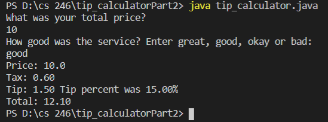

## Overview
This program will take the price of a meal and the rating of the server and will calculate the tip, tax and final cost of the meal.

### Enviorment:
I used visual studio code with java and git downloaded

##### Running the Program:
I simpy inputed "java tip_calculator.java" into the terminal and it displaye the results.

##### Screenshot:

##### Helpful Websites: 
I found w3school.com to be extremely helpful, escpecially their pages on formatting.
https://mkyong.com/java/how-to-format-a-double-in-java/
